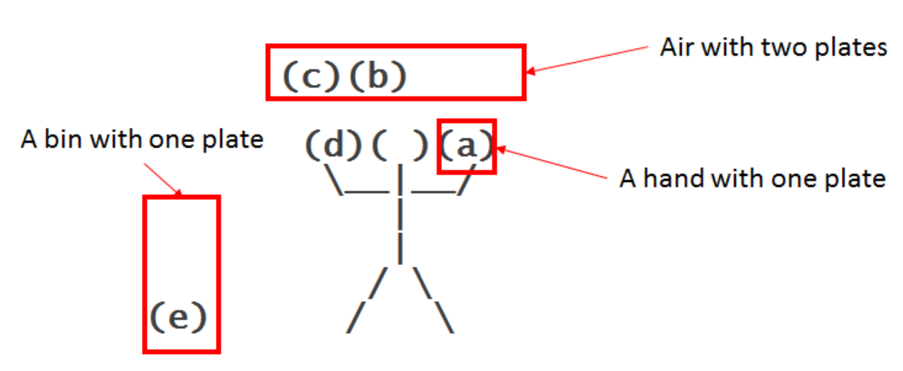
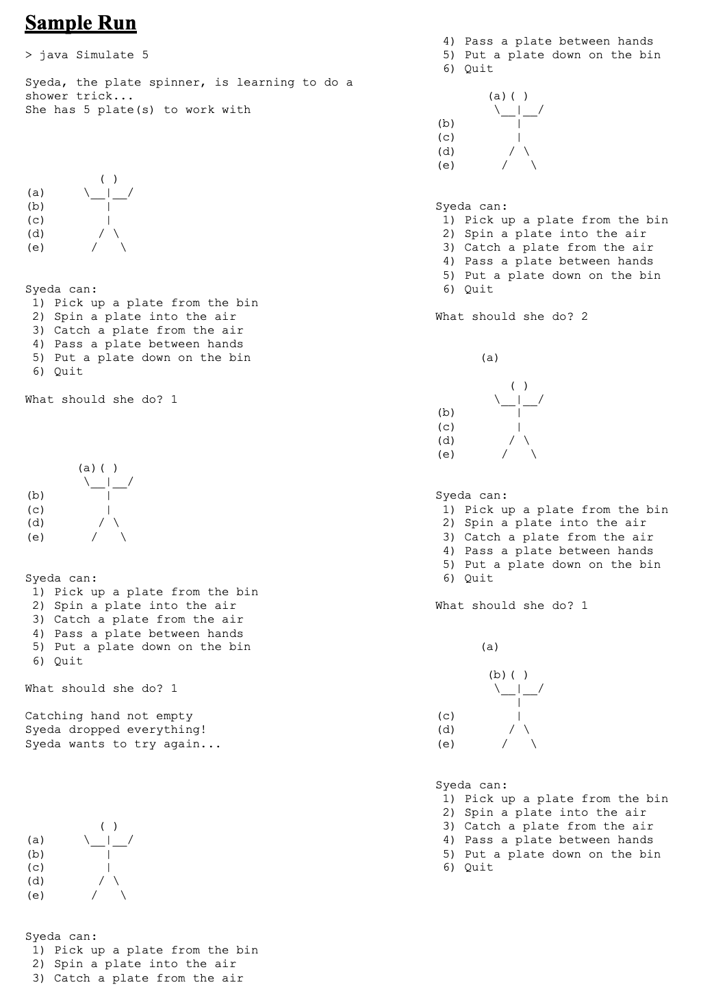

   ## Syeda (Spinning Plates Game)

## Overview: What Goes Up Must Come Down (Spinning Plates)

You are going to build a small game using linked lists. You will have a plate spinner (Syeda) who is using three data structures to spin plates (her hands, a bin, and the air). Her hands will be modeled with a simple data structure that holds a single plate at a time. The bin will be modeled as a stack data structure which can hold any number of items. The air will be modeled as a queue data structure which can hold a specific number of items. 

## What does the Syeda look like?

   There are five plates in the picture above: 2 in the air, 1 in the bin, and 1 in each of Syeda’s hands. The bin is a stack, new plates are placed on top and plates are taken off the top. The air is a queue, the front of the queue in this picture is plate (b) and the back is plate (c). Plates are thrown into the back of the queue and taken out of the front of the queue. This produces what is known as the “shower trick” in juggling.
   
## Sample run:

